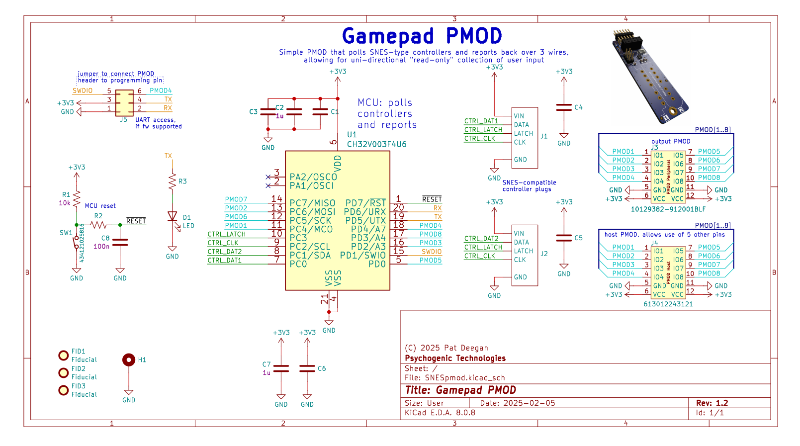
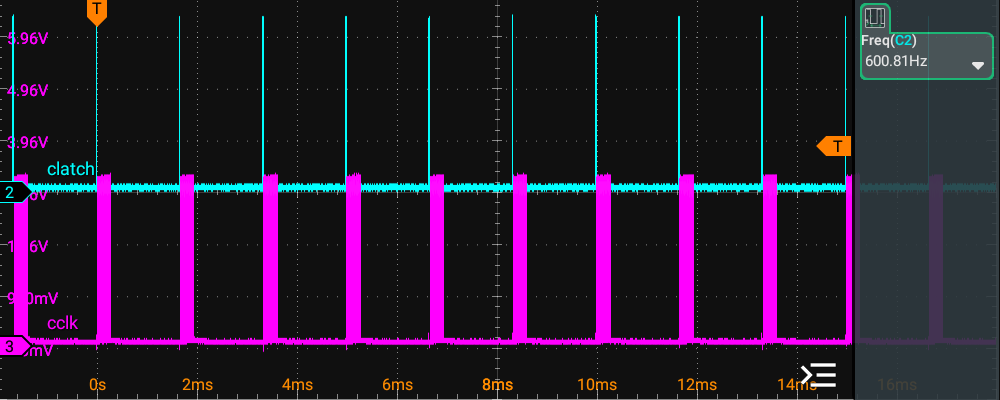

# Gamepad PMOD
CH32V003-based 2xSNES-compatible controller interface PMOD

Copyright (C) 2025 Pat Deegan, [psychogenic.com](https://psychogenic.com)

Released as free and open source software under the terms of the GPL (see [LICENSE](./LICENSE))


## Overview 

This simple module allows 1 or 2 SNES controllers to report their state over 3 pins, and is used with my SNES PMOD.  Here's the first prototype:


It is a variation on the SNES controller protocol that automatically polls the controllers and reports back values.  The main differences are that the data may be sampled on the rising edge of the clock and the latch happens at the end so it acts like a SIPO (serial in, parallel out) shift register and you can just save the values whenever you see the pulse.  

This allows for using the controllers as read-only devices (i.e. using only input pins on your side) and will send all values in a single transaction (e.g. 24 bits of data in one burst for two controllers).

It may be easily configured (by editing the [config definitions file](src/ch32gamepad_config.h)) to specify:

  * whether to report continuously, only on change and/or with a maximum interval between reports (e.g. only on change but at least every 2 seconds, as is the default configuration);
  
  * the number of controllers (1 or 2);
  
  * the PMOD pins to report back on;
  
  * the bitrate at which these reports are sent;

## Using the gamepad in projects

A [verilog module](verilog/) is provided that makes inclusion in projects simple.  Include the [gamepad_pmod.v](verilog/gamepad_pmod.v) source file in your build and, somewhere in your project, instantiate one of 

	* gamepad_pmod_dual -- to support two controllers, or
	
	* gamepad_pmod_single -- to only support a single controller

You then feed the gamepad module the input data, clock and latch from the outside world and from there you receive information about which buttons are pressed at any time.  

More information and basic samples are in the [verilog directory](verilog/).

A nice example of an implementation using this module is Uri's [2048 game](https://github.com/urish/tt10-2048-game).


## Hardware

This code all runs on a simple PMOD that little more than a CH32V003 and headers to connect to the controllers and PMOD.



It also includes:

  * a PMOD host header, so you could in theory leverage the 5 unused input pins using another PMOD
  
  * an extra 2x3 100 mil header that allows you to jumper the PMOD IO4 into the SWDIO pin, to allow for programming through the PMOD header.
  
The complete project is available under [hardware/GamepadPMOD](hardware/GamepadPMOD).


## Protocol

Reports are sent in the following manner, by default over 3 pins:

  * latch; 
  
  * clock; and
  
  * data
  

Sample waveform, one controller disconnected, the other holding 3 buttons:


A disconnected controller reports all 1s, which includes impossible combinations (e.g. up and down at the same time), and lets us detect controller presence.

Data will be asserted on the data line prior to the clock going high and remain valid past when the clock goes low.  After all bits are sent, latch pulses high.

Each bit will be sent in turn, for each controller, in the following order:

  1. B
  
  2. Y
  
  3. select
  
  4. start
  
  5. up
  
  6. down
  
  7. left
  
  8. right
  
  9. A
  
  10. X
  
  11. L
  
  12. R

With a HIGH value indicating the relevant button is pressed.


## Default TT Configuration

The default setup we'll use for [Tiny Tapeout](https://tinytapeout.com) is:

  *  100kHz clock rate, so that even slowish projects can leverage the input;
  
  *  Latch on PMOD IO5 (*ui_in[4]* on the demoboards, PMODs _aren't_ 0-indexed);
  
  *  Clock on PMOD IO6 (*ui_in[5]*);
  
  *  Data on PMOD IO7 (*ui_in[6]*);
  
  *  2 controllers, i.e. 24 bits of data before the latch pulses; and
  
  *  report-on-change but with a maximum interval between bursts of 1 second (minimum interval is about 1.66ms, or a 600Hz rate for reports, like the SNES console)

### Note on latency and clock domains

Though the SNES consoles only polled at 60Hz, nicely sync'ed to the framerate, if you're a speedrunner you could hit some issues if we do the same, as the PMOD isn't synchronized with the system clock.

After discussion with the community and tests with both el-cheapo chinese controllers and an old famicom thing from the 90s, I'm 10x-ing the controller polling rate to 600Hz.  This doesn't actually impact the rate at which the controllers are clocked, it's just that it happens more often and doesn't seem to cause issue.

From the actual SNES controller perspective, the interaction looks like this:




You can see that, on that side, the latch signal comes before the burst of clocking and it's being polled at just around 600Hz.

Since the clocks in projects are independent from the moment at which reports can arrive, its best to do some cleaning for clock domain crossing to ensure stability.


Best and easiest thing is just to use the [gaming_pmod sample module](https://github.com/psychogenic/vga-playground/blob/gaming-pmod/src/examples/gaming/gaming_pmod.v#L109), which handles this.

If you're looking to roll your own, in verilog this would look like classic synchronizer patterns, e.g.

```
reg [1:0] pmod_data_sync;
always @(posedge clk) begin
  if (~rst_n) begin
    pmod_data_sync  <= 2'b0;
  end else begin
    pmod_data_sync  <= {pmod_data_sync[0], pmod_data};
  end
end
```

Whereas with Amaranth, it's little more than using the [FFSynchronizer](https://amaranth-lang.org/docs/amaranth/v0.3/stdlib/cdc.html)

```
FFSynchronizer(i=pmod_data, o=pmod_data_sync)
```


## Building

A selection of pre-compiled firmware is available in [firmware](./firmware), but you may want to build yourself...

To do so, you'll need the awesome [ch32v003fun](https://github.com/cnlohr/ch32v003fun) SDK, by [cnlohr](https://github.com/cnlohr), which is already included here as a submodule.  To ensure you have that, you can do

```
git submodule update --init --recursive
```

from the top level directory.

Then simply (optionally) hook-up a supported programmed to the target module and

```
cd src
make
```

That should be it.

