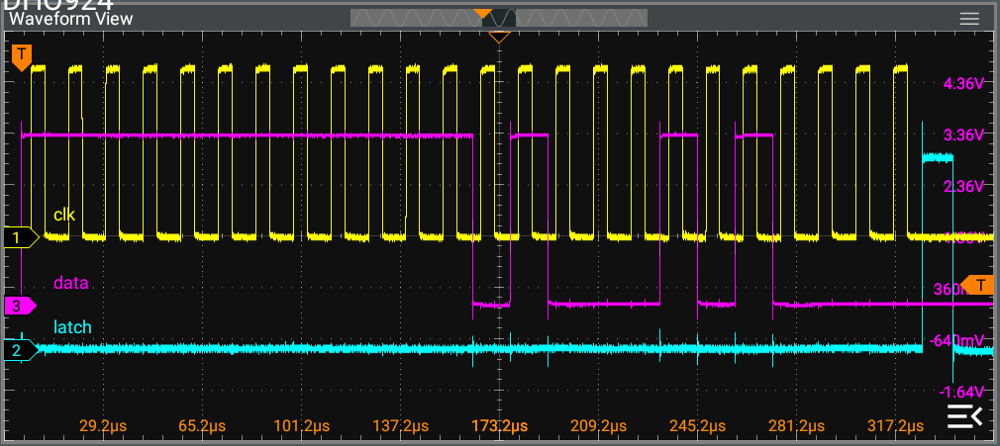

# snespmod
CH32V003-based 2xSNES controller interface PMOD

Copyright (C) 2025 Pat Deegan, [psychogenic.com](https://psychogenic.com)

Released as free and open source software under the terms of the GPL (see [LICENSE](./LICENSE))


## Overview 

This simple module allows 1 or 2 SNES controllers to report their state over 3 pins, and is used with my SNES PMOD.  Here's the first prototype:


It is pretty much a direct translation of the SNES controller protocol, other than in the fact that it automatically polls the controllers and reports back values and that the latch happens at the end so it acts like a SIPO (serial in, parallel out) shift register and you can just save the values whenever you see the pulse.  

This allows for using the controllers as read-only devices (i.e. using only input pins on your side) and will send all values in a single transaction (e.g. 24 bits of data in one burst for two controllers).

It may be easily configured (by editing the [config definitions file](src/ch32snes_config.h)) to specify:

  * whether to report continuously, only on change and/or with a maximum interval between reports (e.g. only on change but at least every 2 seconds, as is the default configuration);
  
  * the number of controllers (1 or 2);
  
  * the PMOD pins to report back on;
  
  * the bitrate at which these reports are sent;


## Protocol

Reports are sent in the following manner, by default over 3 pins:

  * latch; 
  
  * clock; and
  
  * data
  




Data will be asserted on the data line as the clock goes high and remain valid past when the clock goes low (at which time it should be sampled).  After all bits are sent, latch pulses high.

Each bit will be sent in turn, for each controller, in the following order:

  1. B
  
  2. Y
  
  3. select
  
  4. start
  
  5. up
  
  6. down
  
  7. left
  
  8. right
  
  9. A
  
  10. X
  
  11. L
  
  12. R

With a HIGH value indicating the relevant button is pressed.

## Building

A selection of pre-compiled firmware is available in [firmware](./firmware), but you may want to build yourself...

To do so, you'll need the awesome [ch32v003fun](https://github.com/cnlohr/ch32v003fun) SDK, by [cnlohr](https://github.com/cnlohr), which is already included here as a submodule.  To ensure you have that, you can do

```
git submodule update --init --recursive
```

from the top level directory.

Then simply (optionally) hook-up a supported programmed to the target module and

```
cd src
make
```

That should be it.

